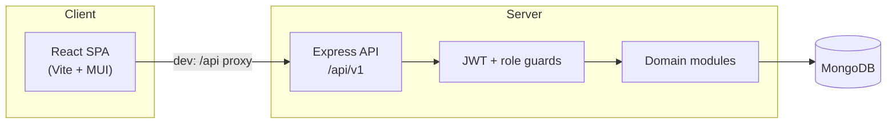

# Housing Society Management System (HSMS)

> A full-stack web platform for residential community administration — members, billing, communication, security, facilities, and inventory — delivered through role-based portals.

[](https://nodejs.org/)
[](https://react.dev/)
[](https://www.mongodb.com/)
[](https://expressjs.com/)

**Final Year Project** · npm workspaces monorepo · React (Vite) + Material UI frontend · Node.js + Express API · MongoDB persistence

---

## Table of contents

- [Overview](#overview)
- [Features](#features)
- [Role-based portals](#role-based-portals)
- [Architecture](#architecture)
- [Tech stack](#tech-stack)
- [Getting started](#getting-started)
- [Scripts](#scripts)
- [Project structure](#project-structure)
- [Configuration](#configuration)
- [Security & operations](#security--operations)
- [Documentation](#documentation)

---

## Overview

HSMS centralizes day-to-day housing society operations in one place. Administrators manage residents and units; accountants handle bills and reports; residents pay maintenance (dummy flow), raise complaints, and book facilities; security staff log visitors, patrols, and SOS alerts.

The codebase is organized as a **monorepo** with separate `frontend` and `backend` workspaces, sharing a single `npm install` at the root.

---

## Features

| Domain | What you can do |
|--------|-----------------|
| **Members & property** | Resident directory, unit CRUD, ownership and tenancy tracking |
| **Finance** | Bill generation, dummy online payments, expense tracking, financial reports, defaulter lists |
| **Communication** | Notice board, complaints with status tracking, polls and voting, SOS alerts |
| **Security** | Visitor logs, guest pre-approval, staff attendance, gate access logs, patrolling |
| **Amenities & assets** | Facility booking with slot checks, society inventory management |

---

## Role-based portals

Each role signs in once and lands on a dedicated portal. Admins can also access accountant and security screens.

| Portal | Route | Primary capabilities |
|--------|-------|----------------------|
| **Admin** | `/admin` | Users, units, ownership, notices, complaints, polls, staff, facilities, inventory |
| **Accountant** | `/accountant` | Bills, expenses, financial reports *(Admin has access too)* |
| **Resident** | `/resident` | Bills (dummy pay), complaints, notices, polls, guest approval, SOS, facility booking |
| **Security Guard** | `/security` | Visitor entry/exit, gate access, staff attendance, SOS acknowledgement, patrol logs *(Admin has access too)* |

Default credentials are created via the seed script — see [Getting started](#getting-started).

---

## Architecture



| Layer | Responsibility |
|-------|----------------|
| **Frontend** | Role portals, shared auth guards, API client, Material UI theme |
| **Backend** | REST API under `/api/v1`, Zod validation, JWT sessions, rate limiting |
| **Integrations** | Notification, gate access, and payment providers (stubbed for demo) |

Backend domain modules: `auth` · `membersUnits` · `billingPayments` · `complaintsCommunication` · `securityVisitors` · `inventoryExpenses`

---

## Tech stack

| Layer | Technologies |
|-------|--------------|
| **Frontend** | React 18, Vite 5, Material UI v6, React Router, Emotion |
| **Backend** | Node.js (ESM), Express 4, Mongoose 8, Zod, JWT, bcryptjs |
| **Database** | MongoDB |
| **Tooling** | npm workspaces, concurrently |

---

## Getting started

### Prerequisites

- **Node.js 18+** — required for `node --watch` in the backend dev script
- **MongoDB** — running locally or reachable via `MONGODB_URI`

### 1. Clone and install

```bash
git clone <repository-url>
cd hsms
npm install
```

### 2. Configure environment

Copy the backend template and edit values as needed:

```bash
# Windows
copy backend\.env.example backend\.env

# macOS / Linux
cp backend/.env.example backend/.env
```

Defaults: `PORT=5002`, `MONGODB_URI=mongodb://127.0.0.1:27017/hsms`.

### 3. Seed the default admin (recommended)

With MongoDB running:

```bash
npm run seed -w backend
```

Uses `SEED_ADMIN_EMAIL` and `SEED_ADMIN_PASSWORD` from `backend/.env`.

### 4. Start development

From the repository root:

```bash
npm run dev
```

| Service | URL |
|---------|-----|
| Frontend | http://localhost:5173 |
| API health | http://localhost:5002/api/v1/health |

The Vite dev server proxies `/api` to the backend. Keep `PORT` in `backend/.env` aligned with the proxy target in `frontend/vite.config.js`.

**Run workspaces separately** (optional):

```bash
npm run dev -w backend
npm run dev -w frontend
```

---

## Scripts

Run from the **repository root**:

| Command | Description |
|---------|-------------|
| `npm run dev` | Start backend and frontend together |
| `npm run build` | Build the frontend for production |
| `npm run start` | Start the backend (production) |
| `npm run smoke` | Health check; optional login verification via env vars |
| `npm run seed -w backend` | Create the default Admin user |

---

## Project structure

```
hsms/
├── backend/
│   └── src/
│       ├── modules/          # Domain routes & services
│       ├── models/           # Mongoose schemas
│       ├── integrations/     # Notification, gate, payment stubs
│       ├── middleware/       # Auth, rate limits, errors
│       └── scripts/          # seed.js, smoke-test.js
├── frontend/
│   └── src/
│       ├── features/         # admin, accountant, resident, security, auth
│       └── shared/           # API client, auth, layout, theme, utils, constants
└── docs/                     # SRS, design artifacts, test traceability
```

<details>
<summary><strong>Backend module map</strong></summary>

| Module | Responsibility |
|--------|----------------|
| `auth` | Login, logout, JWT, role checks |
| `membersUnits` | Users, units, ownership records, resident directory |
| `billingPayments` | Bills, dummy payments, defaulters |
| `complaintsCommunication` | Notices, complaints, polls, votes |
| `securityVisitors` | Visitors, gate logs, staff, SOS, patrols |
| `inventoryExpenses` | Expenses, reports, facilities, bookings, inventory |

</details>

<details>
<summary><strong>Frontend notes</strong></summary>

- **Theme:** Light palette in `frontend/src/shared/theme/theme.js` (Inter typography). No dark mode toggle.
- **Layout:** Authenticated portals use `PortalLayout` inside `AppShell`.
- **Auth:** JWT in `localStorage` (`hsms_token`). Signed-in users are redirected to their role home.

</details>

---

## Configuration

Key variables in `backend/.env` (see [`backend/.env.example`](backend/.env.example) for the full list):

| Variable | Default | Purpose |
|----------|---------|---------|
| `PORT` | `5002` | API listen port |
| `MONGODB_URI` | `mongodb://127.0.0.1:27017/hsms` | Database connection |
| `JWT_SECRET` | — | Signing key *(change in production)* |
| `SESSION_IDLE_TIMEOUT_MS` | `1800000` | JWT expiry (30 min) |
| `SEED_ADMIN_EMAIL` | `admin@hsms.local` | Default admin email for seed |
| `SEED_ADMIN_PASSWORD` | — | Default admin password for seed |

---

## Security & operations

<details>
<summary><strong>Rate limiting, proxy, and smoke tests</strong></summary>

- **JWT sessions** — TTL derived from `SESSION_IDLE_TIMEOUT_MS` ([`backend/src/lib/jwt.js`](backend/src/lib/jwt.js)).
- **Rate limits** — `POST /api/v1/auth/login` and `POST /api/v1/sos/alerts` are limited per IP. Tune via `RATE_LIMIT_*` in `.env.example`.
- **Reverse proxy** — Set `TRUST_PROXY=1` when the API sits behind nginx or Caddy so rate limits see the real client IP.
- **Smoke test** — `npm run smoke` hits `GET /api/v1/health`. Set `SMOKE_BASE_URL=http://127.0.0.1:5002` to match the default port. Optionally set `SMOKE_EMAIL` and `SMOKE_PASSWORD` to verify login ([`backend/src/scripts/smoke-test.js`](backend/src/scripts/smoke-test.js)).

</details>

<details>
<summary><strong>Notifications (bills)</strong></summary>

When a bill is created or bulk-generated, the backend calls `sendNotification` with `channel: "app"` for each resident on that unit. The app channel persists rows to the **`appNotifications`** collection via the **`AppNotifications`** model ([`backend/src/models/AppNotifications.js`](backend/src/models/AppNotifications.js)). Email/SMS remain console stubs in [`backend/src/integrations/notificationProvider.js`](backend/src/integrations/notificationProvider.js) — swap for push or external providers when deploying.

</details>

---

## Documentation

| Document | Description |
|----------|-------------|
| [`docs/README.md`](docs/README.md) | **Documentation index** — start here for all project docs |
| [`docs/plan.md`](docs/plan.md) | Master implementation plan and architecture |
| [`docs/API.md`](docs/API.md) | REST API reference (`/api/v1`) |
| [`docs/TEST_TRACEABILITY.md`](docs/TEST_TRACEABILITY.md) | Test cases TC-01–TC-23 mapped to API routes and UI |
| [`docs/PROJECT_LOG.md`](docs/PROJECT_LOG.md) | Implementation log |
| [`docs/`](docs/) | SRS, design diagrams, and requirement specifications |
